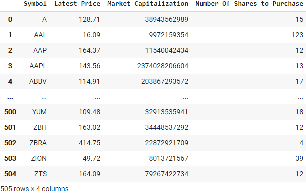

# equal-weight-index-fund

## Description

Equal-weight-index-fund is a short Jupyter notebook that takes a quick look at calculating how many shares of each stock market constituent one should purchase to get an equally weighted index fund, and in this case, for S&P 500. An equal-weight index fund means that each stock has the same weight in the index regardless of the size of the company. I utilized [IEX Cloud APIs](https://iexcloud.io/docs/api/) to attain sandbox test financial data. As a result, the data used in this notebook is not real (but still somewhat similar).

The general process for the notebook was:

1. Import Necessary Packages
2. Attain S&P Stock Listings
3. API Calls
4. Batch API Calls
5. Data Analysis
6. Number of Shares to Purchase

## Usage

Every detailed step was recorded in the notebook and can easily be followed there.

## Examples

